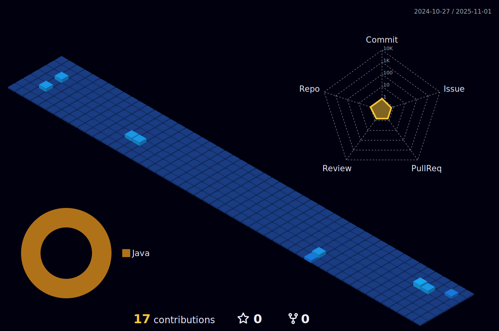

  

    <!-- Typing SVG by DenverCoder1 - https://github.com/DenverCoder1/readme-typing-svg -->
    
  

  

    <!-- Typing SVG by DenverCoder1 - https://github.com/DenverCoder1/readme-typing-svg -->
  
  

  

<h3> 📊 GitHub Profile Stats </h3>

<!-- https://github.com/jstrieb/github-stats -->

<h4> 📈 Activity Grap </h4> 

<h3> 📘 Stack </h3>

### 📖 Learning

  
